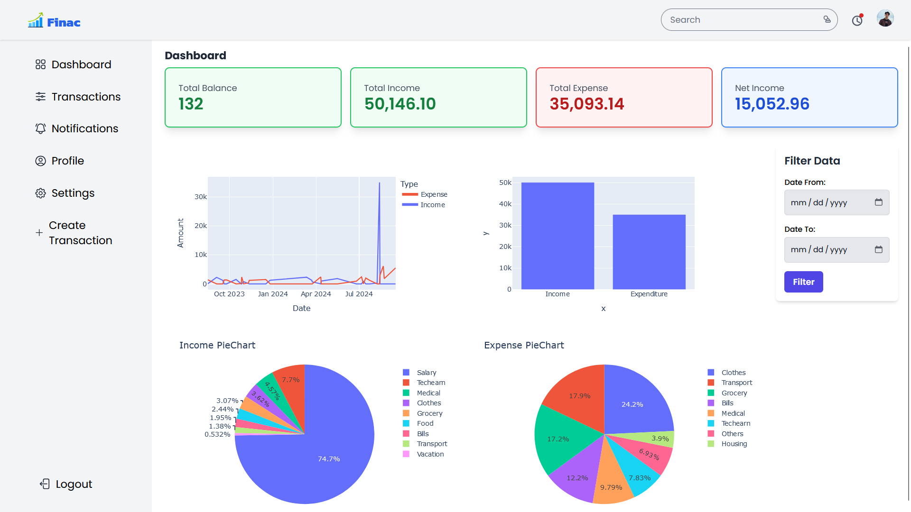

# Finance Tracking System

A web application to help users track income and expenses efficiently. The application provides visual representations of financial data using bar charts and line charts, with options to filter transactions by category, date, and amount. Additionally, it includes features for importing and exporting transactions via CSV files.

## Features

- **Income & Expense Tracking**: Add, edit, and delete transactions.
- **Data Visualization**: Display income/expense data using bar charts and line charts.
- **Filtering Options**: Filter transactions by category, date, and amount.
- **CSV Import/Export**: Import and export transactions in CSV format.
- **Responsive Design**: Clean and responsive design using HTMX for dynamic interaction without full page reloads.

## Demo




## Technologies Used

- **Backend**: Django (Python)
- **Frontend**: HTMX, Tailwind CSS, JavaScript
- **Database**: PostgreSQL
- **Data Visualization**: Chart.js for generating bar and line charts
- **CSV Handling**: Built-in Django CSV support
- **Deployment**: Docker (Optional)
  
## Installation

Follow these steps to set up the project locally.

### Prerequisites

- Python 3.x
- PostgreSQL
- Node.js (for managing frontend dependencies)
- Docker (optional for containerization)

### Steps

1. Clone the repository:
   ```bash
   git clone https://github.com/yourusername/Finance-Tracking-System.git
   cd Finance-Tracking-System
